# Admin OCR Chunk 설정 UI 구현

> 구현일: 2026-08-19  
> 적용 화면: `/admin` → OCR 탭  
> Backend API 변경: 없음

## 1. 구현 목적

기존 OCR 관리자 화면은 모든 문서를 다음 고정값으로 분석했다.

```text
chunkSize = 512
overlap = 50
```

이번 변경으로 관리자가 문서 성격에 따라 RAG용 Chunk Size와 Overlap을 프리셋에서 선택할 수 있다. 설정은 OCR 인식 정확도에 영향을 주지 않고, OCR 및 Native Text 추출이 끝난 다음 실행되는 Chunk 생성 단계에만 적용된다.

## 2. 최종 UI 정책

### Chunk Size

| 선택지 | UI 설명 | 용도 |
| ---: | --- | --- |
| 256 | 세밀 | 짧은 항목, FAQ, 세부 검색 |
| 512 | 기본 | 일반 문서 기본값 |
| 1,024 | 긴 문맥 | 보고서와 설명형 문서 |
| 2,048 | 매우 긴 문맥 | 문맥 유지가 더 중요한 긴 문서 |

### Overlap

| UI 선택지 | 256 | 512 | 1,024 | 2,048 |
| --- | ---: | ---: | ---: | ---: |
| 없음 | 0 | 0 | 0 | 0 |
| 약 10% · 기본 | 25 | 50 | 100 | 200 |
| 약 15% | 40 | 75 | 150 | 300 |
| 약 20% | 50 | 100 | 200 | 400 |

기본값은 기존 동작과 같은 `512 / 50`이다. 1문자 단위 입력은 의미 없는 미세 조정을 늘리고 실험 재현성을 낮출 수 있어 기본 UI에서는 제공하지 않는다.

## 3. 사용자 동작 흐름

```text
관리자 OCR 탭 진입
→ 파일 선택
→ Chunk Size 프리셋 선택
→ Overlap 비율 프리셋 선택
→ 화면에서 실제 서버 전송 문자 수 확인
→ 문서 분석 테스트 실행
→ 선택값을 multipart FormData로 전송
→ Backend Chunk Service가 해당 값으로 결과 분할
```

설정 영역은 파일 선택 여부와 관계없이 표시된다. OCR 분석이 시작되면 파일 변경과 마찬가지로 설정 Select도 비활성화되어 실행 중인 요청값과 화면 표시값이 달라지는 것을 방지한다.

## 4. 데이터 흐름

```mermaid
flowchart LR
    UI[OcrChunkSettings] -->|Chunk/Overlap 선택| Hook[useOcrTest]
    Hook -->|chunkSize, overlap| Service[apiAdminAiService]
    Service -->|multipart FormData| Job[POST /api/admin/ocr/jobs]
    Job --> Core[DocumentProcessingService]
    Core --> Chunk[create_chunks]
    Chunk --> Result[chunks + estimatedChunks]
```



`OcrChunkSettings`는 비율 이름만 표시하지 않고 `서버 전송값: Chunk N자 · Overlap N자`를 함께 보여 준다. 따라서 약 10%, 15%, 20% 프리셋이 실제로 몇 문자로 변환되는지 분석 전에 확인할 수 있다.

## 5. 구현 구조

### `adminOptions.ts`

- Chunk Size 허용 프리셋 정의
- Overlap 비율 허용 프리셋 정의
- Chunk Size별 실제 Overlap 문자 수 매핑
- `getOcrOverlap()` 변환 함수 제공
- TypeScript literal type으로 UI 밖의 임의 프리셋 사용 방지

### `OcrChunkSettings.tsx`

- Chunk Size Select 렌더링
- Overlap Select 렌더링
- 설정 설명 및 실제 서버 전송값 표시
- 분석 중 두 Select 비활성화
- label과 heading을 사용한 접근 가능한 입력 구조

### `useOcrTest.ts`

- 선택된 `chunkSize`와 `overlapPercent` 상태 보관
- `getOcrOverlap()`으로 실제 Overlap 문자 수 계산
- 기존 고정 상수 대신 현재 선택값을 `analyzeDocument()`에 전달
- 파일을 교체하거나 제거해도 실험 설정은 유지

### `OcrPanel.tsx`

- Dropzone/선택 파일과 미리보기 사이에 설정 컴포넌트 배치
- Hook 상태와 변경 함수를 설정 컴포넌트에 연결
- OCR 실행 상태를 `disabled` 속성으로 전달

### `admin.css`

- 기존 Admin 색상 변수를 재사용한 설정 카드 스타일 추가
- 기존 `.admin-field` 입력 스타일을 Select에도 적용
- 모바일에서는 두 설정 열을 한 열로 전환

## 6. Backend 호환성

Backend 수정은 필요하지 않다. 기존 Job API가 이미 다음 값을 `multipart/form-data`로 받는다.

```text
file
chunkSize: 100 이상 4096 이하
overlap: 0 이상
```

문서 처리 서비스는 추가로 `overlap < chunkSize`를 검증한다. 이번 프리셋의 최대 Overlap은 Chunk Size의 약 20%이므로 모든 조합이 기존 검증 조건을 만족한다.

## 7. OCR 및 LLM과의 관계

### OCR

설정 변경은 PaddleOCR 호출, PDF 디지털/Hybrid/스캔 판별, 이미지 전처리, 신뢰도 계산에 영향을 주지 않는다. 추출된 최종 문자열을 `create_chunks()`에서 나누는 방법만 달라진다.

### LLM

LLM 비교 화면에는 기존부터 별도의 숫자 입력 UI가 있다. 현재 LLM Backend는 Mock이므로 `chunkSize`와 `overlap`을 실제 검색이나 모델 입력에 사용하지 않고 응답에 되돌려 준다. 이번 구현은 OCR 관리자 화면에만 적용했으며 LLM 화면은 변경하지 않았다.

향후 실제 RAG를 연결할 때는 문서 저장 시 사용한 Chunk 설정을 메타데이터로 함께 저장하고, LLM 검색에서는 해당 문서의 저장 설정을 기준으로 사용하는 것이 안전하다.

## 8. 변경 파일

| 파일 | 변경 내용 |
| --- | --- |
| `frontend/src/features/admin/constants/adminOptions.ts` | 프리셋, 타입, Overlap 매핑 함수 추가 |
| `frontend/src/features/admin/components/ocr/OcrChunkSettings.tsx` | 설정 UI 신규 추가 |
| `frontend/src/features/admin/components/ocr/OcrPanel.tsx` | 설정 UI 배치 및 Hook 연결 |
| `frontend/src/features/admin/hooks/useOcrTest.ts` | 선택 상태와 실제 요청값 연결 |
| `frontend/src/features/admin/admin.css` | 데스크톱/모바일 설정 UI 스타일 추가 |
| `docs/09_OCR_작동_구조_흐름_순서_분석_2026-08-19.md` | 기존 OCR 분석 문서를 가변 프리셋 구조로 갱신 |

## 9. 검증 결과

Frontend에서 다음 명령으로 TypeScript와 production bundle을 검증했다.

```powershell
cd frontend
npm.cmd run build
```

검증 결과:

```text
TypeScript type check 통과
Vite production build 통과
1877 modules transformed
```

Frontend에는 현재 별도 단위 테스트 또는 컴포넌트 테스트 스크립트가 없어 build 검증을 기준으로 삼았다.

## 10. 향후 확장 시 권장 사항

현재 OCR 추출과 Chunk 생성은 하나의 요청 안에서 연속 실행된다. 같은 문서에서 Chunk 설정만 비교해도 PaddleOCR를 다시 수행한다. 설정 실험이 많아지면 다음 구조가 효율적이다.

```text
문서 OCR/Native Text 추출
→ 정제 텍스트 임시 저장
→ Chunk 설정만 변경
→ OCR 재실행 없이 Chunking 재실행
```

실제 VectorDB 저장 기능이 추가되면 문서별 `chunkSize`, `overlap`, Chunker 버전을 함께 기록해야 검색 결과를 재현하고 재색인 여부를 판단할 수 있다.
