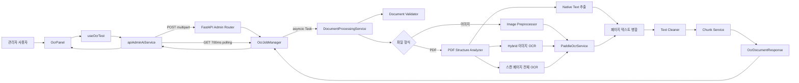
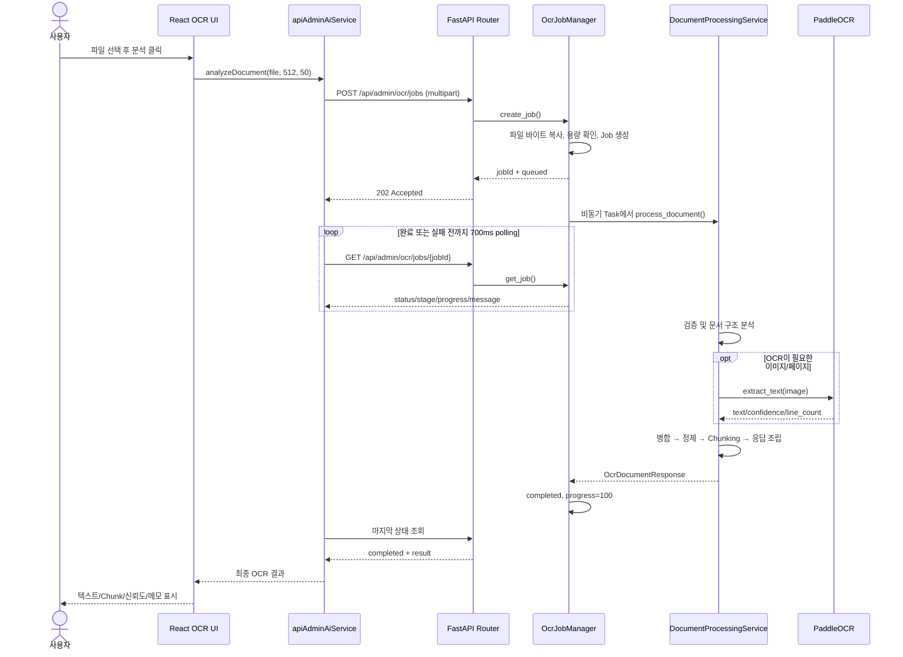
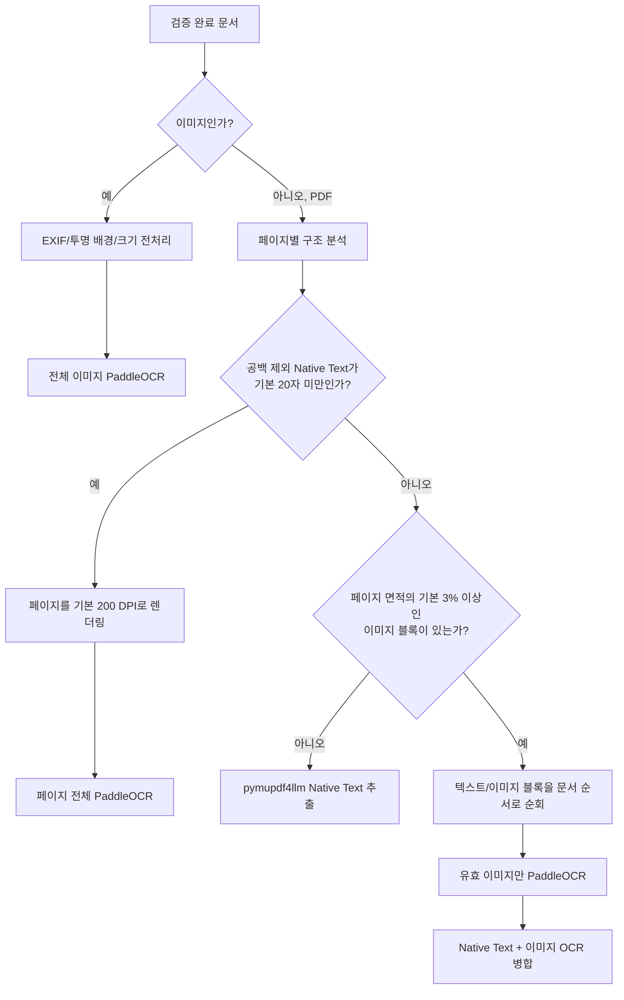

# OCR 작동 구조·흐름·순서 분석

> 2026-08-20 변경: DOCX/PPTX 변환 경로가 추가된 최신 구조는
> `12_OCR_전체_구조_흐름_분석_2026-08-20.md`에 정리되어 있다.

> 분석 기준일: 2026-08-19  
> 분석 기준: 현재 저장소의 실제 소스 코드  
> 실제 동작 위치: React 관리자 화면 `/admin` ↔ FastAPI `/api/admin/ocr/*`

## 1. 결론 요약

이 프로젝트의 OCR은 모든 PDF 페이지를 무조건 OCR하는 방식이 아니다. 문서 형식과 PDF 페이지 구조를 먼저 판별한 다음 필요한 영역에만 PaddleOCR를 적용하는 **Hybrid OCR 파이프라인**이다.

전체 순서는 다음과 같다.

```text
파일 선택
→ 메모리 OCR Job 생성
→ Frontend가 700ms 간격으로 Job 상태 조회
→ 파일/Chunk 옵션 검증
→ 이미지 또는 PDF 구조 분석
→ 필요한 대상만 PaddleOCR 실행
→ 페이지 순서대로 텍스트 병합
→ 텍스트 정제
→ RAG 검토용 Chunk 생성
→ 신뢰도·등록 준비 상태 계산
→ Job 완료
→ 관리자 화면에 결과 표시
```

핵심 특성은 다음과 같다.

- 이미지(`png`, `jpg`, `jpeg`)는 전처리 후 전체 이미지를 PaddleOCR로 처리한다.
- PDF는 페이지마다 Native Text 양과 유효 이미지 면적을 조사한다.
- 텍스트가 충분한 디지털 PDF 페이지는 OCR 없이 `pymupdf4llm`으로 텍스트를 추출한다.
- 텍스트가 충분하면서 큰 이미지가 있는 페이지는 Native Text와 이미지 OCR 결과를 원래 블록 순서대로 합친다.
- Native Text가 부족한 스캔 페이지는 페이지 전체를 이미지로 렌더링한 뒤 PaddleOCR로 처리한다.
- OCR 결과는 바로 저장하지 않고 정제와 Chunking을 거쳐 관리자 검토 결과로만 반환한다.
- `VectorDB 저장 테스트`는 현재 실제 저장이 아닌 Mock이다.

## 2. 현재 OCR 기능의 실제 범위

프로젝트 안에는 OCR처럼 보이는 화면과 코드가 여러 곳 있지만 실제 구현 상태가 서로 다르다.

| 위치 | 현재 상태 |
| --- | --- |
| `/admin`의 OCR 탭 | 실제 파일 업로드, Hybrid OCR, 진행률 조회, 결과 표시까지 구현됨 |
| `/ocr` 페이지 | `<h1>OCR 결과</h1>`만 표시하는 placeholder |
| 채팅의 `DocumentPreviewPanel` | 실제 OCR이 아니라 Mock 추출 텍스트 표시 |
| `ai/ocr/` | 실행 구현이 없는 자리 표시용 디렉터리 |
| `POST /api/admin/ocr/vector-save-test` | 실제 VectorDB 저장 없이 성공 메시지만 반환 |

따라서 현재 OCR을 이해하거나 수정할 때의 중심 코드는 `backend/app/services/hybrid_ocr/`이며, 실제 사용자 진입점은 관리자 페이지이다.

루트 `README.md`의 “OCR은 Mock”, “파일 본문을 전송하지 않는다”는 설명은 현재 코드보다 이전 상태를 기술한다. 현재 관리자 OCR은 실제 파일 본문을 `multipart/form-data`로 Backend에 전송하고 실제 PaddleOCR 파이프라인을 호출한다.

## 3. 전체 아키텍처



레이어별 책임은 명확하게 분리되어 있다.

| 레이어 | 책임 |
| --- | --- |
| React Component | 파일 선택, 미리보기, 진행률 및 결과 표시 |
| React Hook | OCR/저장 상태와 취소용 `AbortController` 관리 |
| Frontend Service | `FormData` 생성, Job 생성, polling, API 응답 변환 |
| FastAPI Router | HTTP 입력 검증, 서비스 호출, 도메인 오류를 HTTP 상태로 변환 |
| Job Manager | 업로드 바이트 복사, 비동기 Task 생성, 진행률·결과·TTL 관리 |
| Document Processing Service | 검증 → 추출 → 정제 → Chunking → 응답 조립 순서 통제 |
| PDF/Image 세부 서비스 | 형식별 분석, 전처리, OCR 실행, Native Text 병합 |
| Paddle OCR Adapter | 모델 지연 초기화, 추론 직렬화, 결과 파싱 |

## 4. 사용자 요청부터 결과 표시까지의 순서

### 4.1 Frontend 순서

1. 사용자가 `/admin`의 OCR 탭에서 파일을 선택하거나 Dropzone에 끌어 놓는다.
2. `OcrDropzone`은 브라우저 파일 선택기의 `accept`를 `.pdf,.png,.jpg,.jpeg`로 제한한다.
3. `useOcrTest.selectFile()`이 기존 요청을 중단하고 이전 결과·오류·저장 상태를 초기화한다.
4. `OcrFilePreview`가 `URL.createObjectURL()`로 로컬 PDF 또는 이미지 미리보기를 만든다.
5. 사용자가 `문서 분석 테스트`를 누르면 `useOcrTest.analyze()`가 다음 상태를 만든다.
   - `status = loading`
   - `progress = uploading / 0%`
   - 새 `AbortController` 생성
6. Frontend는 관리자가 선택한 Chunk 프리셋과 실제 파일을 `FormData`에 담는다. 기본값은 기존과 같은 `chunkSize=512`, `overlap=50`이다.
7. `POST /api/admin/ocr/jobs`로 Job을 생성한다.
8. 받은 `jobId`로 `GET /api/admin/ocr/jobs/{jobId}`를 700ms 간격으로 반복 호출한다.
9. 각 응답의 `stage`, `progress`, `message`를 진행 막대에 반영한다.
10. 상태가 `completed`이면 `result`를 화면에 표시하고, `failed`이면 `error`를 사용자에게 표시한다.

### 4.2 HTTP/API 순서



### 4.3 제공되는 API

| Method | Path | 역할 | 현재 Frontend 사용 여부 |
| --- | --- | --- | --- |
| `POST` | `/api/admin/ocr/jobs` | OCR Job 생성, `202 Accepted`와 `jobId` 반환 | 사용 |
| `GET` | `/api/admin/ocr/jobs/{jobId}` | 진행률, 실패, 완료 결과 조회 | 사용 |
| `POST` | `/api/admin/ocr/analyze` | 요청 연결을 유지하며 결과를 직접 반환하는 동기형 호환 API | 미사용 |
| `POST` | `/api/admin/ocr/vector-save-test` | VectorDB 저장 사용자 흐름만 시험하는 Mock API | 사용 |

`/ocr/analyze`도 내부적으로 같은 `process_document()`를 사용하므로 OCR 품질과 분기 로직은 Job API와 동일하다. 차이는 작업 상태를 별도 조회하느냐, 한 HTTP 요청에서 최종 결과를 기다리느냐이다.

## 5. Backend Job 구조와 생명주기

### 5.1 Job 생성

`OcrJobManager.create_job()`은 원본 `UploadFile`을 먼저 최대 크기보다 1바이트 더 읽는다. FastAPI 요청이 끝난 뒤 원본 파일이 닫혀도 작업이 가능하도록 바이트를 메모리에 복사하기 위한 동작이다.

그 다음 순서는 다음과 같다.

1. 최대 파일 크기 확인
2. 완료·실패 후 TTL이 지난 Job 제거
3. `queued` 또는 `processing` 상태 Job 수 계산
4. `OCR_MAX_PENDING_JOBS` 이상이면 거부
5. UUID hex 문자열로 `jobId` 생성
6. 메모리 딕셔너리에 `queued`, 3% 상태 저장
7. `asyncio.create_task()`로 실제 작업 시작
8. Frontend에는 즉시 `202 Accepted` 반환

### 5.2 상태 전이

```text
queued
  └─ processing
       ├─ completed (progress=100, result 존재)
       └─ failed    (error 존재, 마지막 progress 유지)
```

- 진행률은 이전 값보다 작아지지 않도록 `max(previous, next)`로 처리한다.
- 작업 중 진행률은 최대 99로 제한하며, 성공 완료 시에만 100이 된다.
- 완료 또는 실패 Job은 `updated_at` 기준 기본 60분 후 만료 대상이 된다.
- 만료 제거는 별도 스케줄러가 아니라 다음 Job 생성 또는 조회 시 지연 수행된다.
- Job, 원본 파일 바이트, 결과 텍스트와 Chunk는 외부 저장소가 아니라 단일 Python 프로세스 메모리에 존재한다.

## 6. 중심 문서 처리 파이프라인

`DocumentProcessingService.process_document()`가 전체 순서를 통제한다.

```text
1. Chunk 옵션 검증
2. 업로드 파일 검증 및 바이트 로드
3. 이미지/PDF 분기
4. 형식별 텍스트 추출
5. 페이지/영역 결과 통합
6. Unicode·공백 정제
7. 문자 기반 Chunk 생성
8. 신뢰도·readiness·notes 계산
9. OcrDocumentResponse 반환
```

CPU 사용량이 큰 형식별 추출은 `asyncio.to_thread()`에서 실행된다. 따라서 OCR/페이지 렌더링 중에도 Uvicorn 이벤트 루프가 polling 요청을 받을 수 있다.

## 7. 입력 검증 순서

Backend는 브라우저의 `accept` 속성을 신뢰하지 않고 다음 항목을 다시 검증한다.

1. 파일명에서 경로 요소를 제거하고 확장자를 소문자로 변환한다.
2. 확장자가 `pdf`, `png`, `jpg`, `jpeg` 중 하나인지 확인한다.
3. 최대 크기보다 1바이트 더 읽어 실제 파일 크기를 확인한다.
4. 빈 파일을 거부한다.
5. 선언된 MIME Type을 허용 목록과 비교한다.
6. PDF는 첫 1,024바이트 안의 `%PDF-` signature를 확인한다.
7. PDF를 실제로 열어 암호화 여부, 0페이지 여부, 최대 페이지 수, 손상 페이지 여부를 확인한다.
8. 이미지는 Pillow로 실제 파일을 열고 픽셀 수를 검사한다.
9. 이미지 확장자와 실제 포맷(`PNG` 또는 `JPEG`)이 일치하는지 확인한다.
10. `overlap < chunkSize`인지 확인한다.

FastAPI Form 자체도 `chunkSize=100..4096`, `overlap>=0`을 검증한다.

## 8. 파일 형식별 처리 분기

### 8.1 분기 규칙



### 8.2 일반 이미지

PNG/JPEG 처리 순서는 다음과 같다.

1. Pillow로 이미지 로드
2. 최대 픽셀 수 재확인
3. EXIF 회전 정보를 실제 픽셀 방향에 반영
4. 투명 배경이 있으면 흰색 배경과 합성
5. RGB로 변환
6. 긴 변이 기본 2,400px를 넘으면 비율을 유지해 축소
7. NumPy 배열로 변환해 PaddleOCR에 전달
8. 인식 텍스트, 평균 신뢰도, 줄 수 반환

### 8.3 디지털 PDF 페이지

공백 제외 Native Text가 기본 20자 이상이고 큰 이미지가 없으면 디지털 페이지로 처리한다.

- `pymupdf4llm.to_markdown()`을 먼저 사용한다.
- 이미지 내용은 `ignore_images=True`로 제외한다.
- Markdown 추출이 실패하거나 빈 결과이면 최초 구조 분석 때 확보한 PyMuPDF 기본 텍스트로 fallback한다.
- fallback 사실은 `notes`에 경고로 남긴다.
- 이 경로에서는 PaddleOCR 모델을 초기화하지 않는다.

### 8.4 스캔 PDF 페이지

공백 제외 Native Text가 기본 20자 미만이면 이미지 존재 여부와 관계없이 페이지 전체 OCR 경로를 선택한다.

1. 페이지를 기본 200 DPI, RGB, 알파 없음으로 렌더링
2. 렌더링 결과를 PNG 바이트로 변환
3. 일반 이미지와 같은 전처리 수행
4. PaddleOCR 호출
5. 결과가 비면 페이지 경고 생성

이 판단은 페이지 단위이므로 한 PDF 안에서도 어떤 페이지는 Native Text, 어떤 페이지는 전체 OCR이 될 수 있다.

### 8.5 Hybrid PDF 페이지

Native Text가 충분하면서 페이지 면적의 기본 3% 이상인 이미지 블록이 있으면 Hybrid 경로를 선택한다.

- `page.get_text("dict", sort=True)`의 블록을 순서대로 순회한다.
- 텍스트 블록은 span의 문자열을 합쳐 그대로 추가한다.
- 이미지 블록은 면적 기준을 통과한 경우에만 OCR한다.
- 이미지 OCR 결과 앞에는 `[이미지 OCR]` 표시를 붙인다.
- Native Text와 OCR 결과가 블록 순서대로 들어가므로 문서 내 위치 관계를 최대한 유지한다.
- 한 이미지 OCR이 실패하면 해당 페이지 전체를 중단하지 않고 경고를 남긴 뒤 다음 블록을 계속 처리한다.
- 단, PaddleOCR 자체를 사용할 수 없는 `OcrUnavailableError`는 전체 작업 실패로 전파한다.

### 8.6 PDF 문서 유형 최종 분류

페이지 처리 출처를 `native`, `hybrid`, `ocr`, `empty`로 기록한 뒤 문서 전체 유형을 계산한다.

| 조건 | 최종 유형 |
| --- | --- |
| 모든 페이지가 `ocr` 또는 `empty` | `scanned_pdf` |
| 하나라도 `ocr` 또는 `hybrid` | `hybrid_pdf` |
| 그 외 | `digital_pdf` |

## 9. PaddleOCR 모델과 결과 파싱

### 9.1 모델 설정

기본 엔진은 PaddleOCR 3.x의 `PP-OCRv5`이고 언어는 `korean`, 장치는 `cpu`이다.

사용 옵션은 다음과 같다.

- 문서 방향 분류 비활성화
- 문서 unwarping 비활성화
- 텍스트 줄 방향 분류 비활성화
- Windows CPU의 PIR 변환 오류 회피를 위해 MKL-DNN 비활성화

설정 장치가 GPU이고 초기화에 실패하면 CPU로 한 번 재시도한다. CPU 설정에서도 실패하거나 PaddleOCR를 import할 수 없으면 `OcrUnavailableError`가 발생한다.

### 9.2 지연 초기화와 재사용

- `get_paddle_ocr_service(device, language)`는 `lru_cache(maxsize=4)`로 같은 설정의 서비스 객체를 재사용한다.
- 실제 Paddle pipeline은 첫 OCR 요청 시점에 생성된다.
- 초기화 Lock으로 같은 프로세스 안에서 중복 모델 생성이 일어나지 않게 한다.
- 추론 Lock으로 하나의 pipeline에 대한 `predict()` 호출을 한 번에 하나씩만 실행한다.

따라서 여러 Job이 동시에 실행되어도 PaddleOCR 추론 구간은 현재 프로세스 안에서 직렬화된다. 디지털 PDF처럼 OCR이 필요 없는 문서는 이 Lock을 사용하지 않는다.

### 9.3 결과 정리

Paddle 결과의 `rec_texts`, `rec_scores`, `rec_boxes`를 읽은 뒤 다음 순서로 단순화한다.

1. 빈 문자열 제거
2. bounding box의 Y 좌표, X 좌표 순으로 정렬
3. 인식 줄을 줄바꿈으로 연결
4. 줄별 점수의 단순 산술평균을 신뢰도로 계산
5. 처리 시간과 줄 수를 함께 `OcrEngineResult`로 반환

## 10. 텍스트 후처리와 Chunking

### 10.1 텍스트 정제

`clean_document_text()`는 의미를 바꾸는 교정은 하지 않고 최소 정리만 수행한다.

- CRLF를 LF로 통일
- Unicode NFKC 정규화
- 허용되지 않은 제어문자 제거
- 줄 끝 공백 제거
- 3개 이상의 연속 줄바꿈을 2개로 축소
- 전체 앞뒤 공백 제거

OCR 오탈자 교정, 맞춤법 교정, 의료 용어 보정은 현재 수행하지 않는다.

### 10.2 Chunk 생성

현재 Chunk는 토큰 기준이 아니라 **문자 수 기준**이다.

- 관리자 UI 기본값: `chunkSize=512`, `overlap=50`
- 관리자 UI 선택값: Chunk Size `256 / 512 / 1024 / 2048`, Overlap `없음 / 약 10% / 15% / 20%`
- 각 Chunk 최대 길이는 `chunkSize`
- Chunk 길이의 60% 이후부터 `빈 줄 → 줄바꿈 → 마침표+공백 → 공백` 순서로 자연스러운 경계를 역검색
- 경계를 못 찾으면 정확히 최대 길이에서 자름
- 다음 시작점은 `end - overlap`
- 무한 루프를 막기 위해 시작점이 최소 1문자 이상 전진하도록 보장

결과의 `estimatedChunks`는 추정식이 아니라 실제 생성된 `chunks` 배열 길이이다.

## 11. 신뢰도와 등록 준비 상태

### 11.1 신뢰도 계산

| 문서 상황 | 계산 방식 |
| --- | --- |
| 일반 이미지 | 인식된 줄 점수의 평균 |
| 스캔/Hybrid PDF | OCR을 수행해 줄을 찾은 각 이미지·페이지 결과 신뢰도의 단순 평균 |
| OCR 신뢰도 표본은 없지만 추출 텍스트가 있음 | `1.0`, 즉 화면에 100% |
| 텍스트도 OCR 신뢰도도 없음 | `0.0` |

최종 응답에서는 0~1 값을 백분율로 바꾸고 소수점 첫째 자리로 반올림한다.

주의할 점은 디지털 PDF의 100%가 OCR 정확도를 측정한 값이 아니라 “Native Text 추출 성공”을 나타내는 대체값이라는 것이다. Hybrid PDF의 평균도 전체 문서 문자 수 가중 평균이 아니라 OCR 대상별 단순 평균이다.

### 11.2 `readiness` 계산

다음 중 하나라도 참이면 `review`, 아니면 `ready`이다.

- 정제 후 텍스트가 비어 있음
- 신뢰도가 80% 미만
- 경고 문자열 중 `실패`가 포함된 항목이 있음

응답의 `notes`에는 문서 유형, PaddleOCR 처리 이미지 수, 페이지/이미지 처리 경고가 포함된다.

## 12. 진행률 단계

진행률은 OCR 엔진 내부의 실제 추론 퍼센트가 아니라 파이프라인 단계와 PDF 페이지 수를 바탕으로 만든 단계형 값이다.

| 대략적 진행률 | stage | 의미 |
| ---: | --- | --- |
| 0 | `uploading` | Frontend 업로드 시작 |
| 3 | `queued` | Backend 메모리 Job 등록 |
| 5 | `uploading` | Backend가 파일 바이트 복사 완료 |
| 8~15 | `validating` | 옵션, 확장자, MIME, 바이너리, 크기, 페이지 검증 |
| 20~25 | `analyzing` | 형식 분기 및 PDF 페이지 구조 분석 |
| 28 | `preprocessing` | 일반 이미지 전처리 |
| 35 또는 페이지 구간 | `loading_model` | PaddleOCR 준비/호출 |
| 최대 80 | `extracting` | 이미지 OCR 또는 PDF 페이지별 추출 |
| 82 | `merging` | 문서 추출 결과 통합 |
| 86~90 | `cleaning` | 텍스트 정제 |
| 93~97 | `chunking` | Chunk 생성 |
| 99 | `finalizing` | API 응답 조립 |
| 100 | `completed` | Job 성공 완료 |

PaddleOCR의 한 번의 `predict()` 내부 진행 상태는 제공되지 않으므로 모델 로딩이나 큰 이미지 추론 중에는 퍼센트가 잠시 멈춰 보일 수 있다.

## 13. 응답 데이터 구조

최종 `OcrDocumentResponse`는 Frontend의 camelCase 계약으로 직렬화된다.

```json
{
  "documentName": "sample.pdf",
  "pageCount": 3,
  "characterCount": 2410,
  "estimatedChunks": 6,
  "confidence": 94.2,
  "extractedText": "## 페이지 1\n\n...",
  "chunks": ["...", "..."],
  "readiness": "ready",
  "notes": [
    "문서 유형: Hybrid PDF",
    "PaddleOCR 처리 이미지: 2개"
  ]
}
```

PDF 텍스트에는 내용이 있는 페이지마다 `## 페이지 N` 제목이 추가된다. 이미지 단일 문서에는 페이지 제목을 붙이지 않는다.

## 14. 오류 처리

### 14.1 직접 분석 API의 HTTP 매핑

| 도메인 오류 | HTTP 상태 |
| --- | ---: |
| 파일 크기 초과 | 413 |
| 형식, MIME, 암호화, 페이지 수, Chunk 옵션 오류 | 422 |
| PaddleOCR 설치/모델 초기화 불가 | 503 |
| 문서/OCR 처리 실패 | 500 |

### 14.2 Job API의 오류 노출 방식

- Job 생성 전에 확인되는 파일 크기 초과는 `413`이다.
- 활성 Job 제한 초과는 `429`이다.
- 없거나 만료된 Job 조회는 `404`이다.
- Job이 생성된 뒤 발생한 검증/OCR 도메인 오류는 polling 응답의 `status="failed"`, `error="..."`로 전달된다.
- 예상하지 못한 예외는 내부 로그에 stack trace를 남기고 사용자에게 일반화된 오류 문구를 보낸다.
- PDF의 개별 페이지 또는 이미지 영역 처리 실패는 가능한 경우 전체 작업 실패 대신 경고와 부분 결과로 반환된다.

## 15. 설정값과 의존성

### 15.1 기본 환경 설정

| 환경 변수 | 기본값 | 역할 |
| --- | ---: | --- |
| `OCR_MAX_FILE_SIZE_MB` | 20 | 업로드 최대 파일 크기 |
| `OCR_MAX_PDF_PAGES` | 50 | PDF 최대 페이지 수 |
| `OCR_NATIVE_TEXT_MIN_CHARS` | 20 | 페이지 전체 OCR 여부를 가르는 공백 제외 Native Text 문자 수 |
| `OCR_SIGNIFICANT_IMAGE_AREA_RATIO` | 0.03 | Hybrid OCR 대상 이미지의 최소 페이지 면적 비율 |
| `OCR_PDF_RENDER_DPI` | 200 | 스캔 페이지 렌더링 DPI |
| `OCR_MAX_IMAGE_SIDE` | 2400 | 전처리 후 이미지 긴 변 최대값 |
| `OCR_MAX_IMAGE_PIXELS` | 40000000 | 입력/렌더 이미지 최대 픽셀 수 |
| `OCR_PADDLE_DEVICE` | `cpu` | Paddle 실행 장치 |
| `OCR_PADDLE_LANGUAGE` | `korean` | OCR 언어 |
| `OCR_JOB_TTL_MINUTES` | 60 | 완료/실패 Job 보존 시간 |
| `OCR_MAX_PENDING_JOBS` | 5 | `queued + processing` 최대 Job 수 |

설정은 앱 시작 시 `settings`와 기본 `DocumentProcessingService`를 만들 때 읽힌다. 실행 중 `.env`만 변경해도 이미 생성된 서비스에는 반영되지 않으므로 프로세스를 재시작해야 한다.

### 15.2 주요 Python 의존성

| 패키지 | 역할 |
| --- | --- |
| `paddlepaddle` | Paddle 실행 엔진 |
| `paddleocr` | PP-OCRv5 파이프라인 |
| `PyMuPDF` | PDF 검증, 구조 분석, 페이지 렌더링, 기본 텍스트 추출 |
| `pymupdf4llm` | 디지털 PDF를 구조화된 Markdown으로 추출 |
| `Pillow` | 이미지 검증과 전처리 |
| `numpy` | Pillow 이미지를 Paddle 입력 배열로 변환 |
| `python-multipart` | FastAPI 파일 업로드 처리 |

Docker 이미지는 Python 3.11 slim을 기준으로 모든 OCR 의존성을 설치한다. Paddle 모델 파일은 이미지 빌드에 포함하지 않으며 첫 OCR 실행 때 다운로드될 수 있다.

## 16. 동시성·메모리·운영 특성

- OCR Job 저장소는 DB나 Redis가 아닌 프로세스 내부 딕셔너리이다.
- 여러 Uvicorn worker를 사용하면 worker마다 서로 다른 Job 저장소와 Paddle 모델을 가진다.
- 프로세스 재시작 또는 재배포 시 진행 중/완료 Job이 모두 사라진다.
- 로드밸런서가 polling 요청을 다른 worker로 보내면 Job을 찾지 못할 수 있다.
- 처리 중인 Job Task는 업로드 원본 바이트를, 완료된 Job Record는 최종 전체 텍스트와 Chunk를 메모리에 보관한다.
- `OCR_MAX_PENDING_JOBS`는 대기열 worker 수가 아니라 활성 Job 개수 제한이다. 허용된 Job은 각각 즉시 `asyncio.Task`로 시작한다.
- CPU 작업은 thread로 분리되지만 Paddle 추론은 서비스의 inference Lock으로 직렬화된다.
- 최초 OCR은 모델 초기화/다운로드 때문에 이후 요청보다 오래 걸릴 수 있다.
- Frontend의 Abort는 업로드 또는 polling만 중단한다. 이미 생성된 Backend Job이나 Paddle 추론을 취소하지 않는다.

현재 구조는 단일 프로세스의 관리자 테스트 도구에는 단순하고 적합하지만, 다중 worker·재시작 복원·대량 문서 처리에는 외부 Job Queue와 영속 상태 저장소가 필요하다.

## 17. 테스트로 확인되는 동작

`backend/tests/test_hybrid_ocr.py`는 실제 모델 대신 `FakeOcrEngine`을 주입해 다음을 검증한다.

- 디지털 PDF가 OCR을 호출하지 않는지
- 스캔 PDF가 페이지 전체 OCR을 한 번 호출하는지
- Hybrid PDF가 Native Text 사이에 이미지 OCR 결과를 삽입하는지
- PNG/JPG 지원
- 큰 이미지 축소와 EXIF 회전 적용
- 다중 페이지 순서 보존
- 빈 OCR 결과가 `review`가 되는지
- 손상/암호화 PDF, 손상 이미지, 잘못된 MIME, 크기 초과 거부
- 확장자와 실제 바이너리 불일치 거부
- 잘못된 overlap 거부
- Chunk 진행과 최대 길이 보장

`backend/tests/test_ocr_jobs.py`는 다음을 검증한다.

- 진행률 보고 후 완료 결과 제공
- 도메인 오류의 failed 상태 변환
- 활성 Job 수 제한
- 존재하지 않는 Job 조회 오류

이 테스트들은 구조와 제어 흐름을 빠르게 검증하지만 실제 Paddle 모델의 한국어 인식 품질, 첫 모델 다운로드, 실제 GPU/CPU 환경, 다중 프로세스 동작은 검증하지 않는다.

## 18. 코드 분석에서 확인된 주의점과 개선 우선순위

### 높음

1. **관리자 OCR 접근 제어가 없다.** Frontend `/admin` 라우트는 `RequireAuth` 밖에 있고 Backend admin router에도 인증/관리자 권한 dependency가 없다. 공개 배포 시 비용이 큰 OCR API를 누구나 호출할 수 있다.
2. **Job이 프로세스 메모리에만 있다.** 재시작, 다중 worker, 수평 확장 환경에서 Job 조회 신뢰성이 없다. 운영 환경에서는 Redis/Celery/RQ/별도 worker 같은 외부 Queue와 상태 저장소가 필요하다.
3. **서버 작업 취소가 없다.** 사용자가 파일을 바꾸거나 페이지를 나가면 Frontend polling만 중단되고 Backend OCR은 계속 CPU와 메모리를 사용한다.

### 중간

4. **화면 안내 문구가 실제 동작과 반대이다.** Dropzone은 “실제 파일 내용은 읽거나 전송하지 않습니다”라고 표시하지만 실제 파일 전체를 Backend로 전송한다. 개인정보·의료문서 취급 관점에서 즉시 수정할 필요가 있다.
5. **루트 README가 현재 구현과 불일치한다.** OCR을 Mock으로 설명하고 이전 `/ocr/analyze` 흐름만 기록한다.
6. **디지털 PDF의 100%는 품질 점수가 아니다.** Native Text가 존재하면 OCR 표본 없이 100%가 표시되므로 UI에서 “추출 신뢰도”처럼 해석하면 오해가 생긴다.
7. **Hybrid OCR 누락 경고가 readiness에 항상 반영되지는 않는다.** `readiness`는 빈 전체 텍스트, 80% 미만, 또는 문구에 `실패`가 있는 경고만 본다. 이미지에서 텍스트를 찾지 못했다는 경고가 있어도 Native Text가 있고 신뢰도가 높으면 `ready`가 될 수 있다.
8. **업로드 바이트를 중복 보유할 수 있다.** Job 생성 시 파일을 메모리에 복사하고, 처리용 `BytesIO`와 검증 결과에도 같은 내용이 전달된다. 큰 동시 요청에서는 메모리 사용량을 측정할 필요가 있다.

### 낮음/품질 개선

9. Chunk는 토큰이 아닌 문자 기준이므로 실제 embedding 모델의 토큰 한도와 정확히 일치하지 않는다.
10. OCR 오탈자/의료 용어 보정, 표 전용 처리, 수식/필기 인식, 기울기 보정은 없다.
11. 모델 pre-warm과 별도 OCR readiness check가 없어 첫 요청에서 긴 대기나 모델 다운로드 실패가 나타난다.
12. 진행률은 단계 기반 추정치라 단일 Paddle 추론 동안 세밀하게 증가하지 않는다.

## 19. 주요 소스 파일 지도

| 파일 | 핵심 역할 |
| --- | --- |
| `frontend/src/features/admin/components/ocr/OcrPanel.tsx` | OCR 화면 조립 |
| `frontend/src/features/admin/components/ocr/OcrChunkSettings.tsx` | Chunk Size와 Overlap 프리셋 선택 및 실제 전송값 표시 |
| `frontend/src/features/admin/hooks/useOcrTest.ts` | 파일, 진행률, 결과, 취소 상태 관리 |
| `frontend/src/features/admin/services/apiAdminAiService.ts` | Job 생성과 700ms polling |
| `frontend/src/services/apiClient.ts` | API base URL, FormData/JSON 전송, 오류 변환 |
| `backend/app/api/admin/router.py` | OCR HTTP endpoint와 상태 코드 매핑 |
| `backend/app/schemas/admin.py` | Job 및 OCR 결과 API 계약 |
| `backend/app/services/ocr_job_service.py` | 메모리 Job 생성·진행·완료·실패·TTL 관리 |
| `backend/app/services/hybrid_ocr/document_processing_service.py` | 전체 OCR 파이프라인의 중심 오케스트레이터 |
| `backend/app/services/hybrid_ocr/document_validator.py` | 파일/형식/크기/페이지/Chunk 검증 |
| `backend/app/services/hybrid_ocr/pdf_parser_service.py` | PDF 구조 판별, Native/Hybrid/스캔 처리 |
| `backend/app/services/hybrid_ocr/image_preprocessor.py` | EXIF, 투명 배경, RGB, 리사이즈 처리 |
| `backend/app/services/hybrid_ocr/paddle_ocr_service.py` | Paddle 모델 생성, Lock, 추론, 결과 파싱 |
| `backend/app/services/hybrid_ocr/text_cleaner.py` | Unicode와 공백 정제 |
| `backend/app/services/hybrid_ocr/chunk_service.py` | 자연 경계 우선 문자 Chunk 생성 |
| `backend/app/core/config.py` | OCR 환경 설정 기본값 |
| `backend/tests/test_hybrid_ocr.py` | 형식별 파이프라인 단위 테스트 |
| `backend/tests/test_ocr_jobs.py` | Job 생명주기 단위 테스트 |

## 20. 문제 발생 시 추적 순서

| 증상 | 먼저 확인할 위치 |
| --- | --- |
| 파일 선택 버튼이 비활성/결과가 초기화됨 | `useOcrTest.ts`, `OcrPanel.tsx` |
| 업로드/API 주소 오류 | `apiAdminAiService.ts`, `apiClient.ts`, `VITE_API_URL` |
| Job이 404 | 프로세스 재시작, 다중 worker 여부, `ocr_job_service.py` TTL |
| 파일 형식/MIME/암호화 오류 | `document_validator.py` |
| 디지털 PDF인데 OCR 실행 | `OCR_NATIVE_TEXT_MIN_CHARS`, `analyze_pdf_structure()` |
| PDF 이미지가 OCR되지 않음 | `OCR_SIGNIFICANT_IMAGE_AREA_RATIO`, 이미지 block bbox |
| OCR 모델 import/초기화 실패 | Paddle 설치 상태, 모델 다운로드 네트워크, `OCR_PADDLE_DEVICE` |
| 추출 순서가 어긋남 | `_parse_predictions()` box 정렬, `_process_hybrid_page()` block 순서 |
| 신뢰도가 예상과 다름 | PDF `confidences` 집계와 `_build_response()` 백분율 변환 |
| Chunk가 너무 짧거나 문장이 잘림 | `chunkSize`, `overlap`, `_find_natural_boundary()` |
| 브라우저 중단 후에도 CPU 사용 | 서버 취소 API가 없는 현재 Job 구조 |

## 21. 한 문장으로 정리한 실제 호출 체인

```text
AdminPage
→ OcrPanel
→ useOcrTest.analyze
→ apiAdminAiService.analyzeDocument
→ POST /api/admin/ocr/jobs
→ OcrJobManager.create_job/_run_job
→ DocumentProcessingService.process_document
→ validate_document
→ image_preprocessor 또는 pdf_parser_service
→ PaddleOcrService(필요한 경우만)
→ clean_document_text
→ create_chunks
→ OcrDocumentResponse
→ OcrJobManager.completed
→ GET polling 응답
→ OcrResultSummary
```
